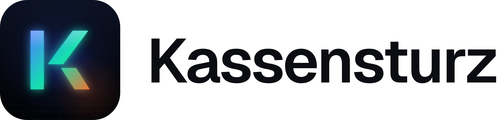
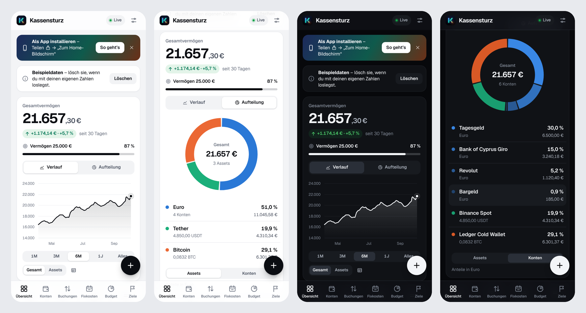

<p align="center">
  <picture>
    <source media="(prefers-color-scheme: dark)" srcset="brand/png/kassensturz-logo-dark.png">
    
  </picture>
</p>

<p align="center"><b>Deine Finanzen in Euro, USDT und Bitcoin – alles live in Euro umgerechnet.</b><br>
Als App auf dem iPhone, läuft offline, deine Daten bleiben auf deinem Gerät.</p>

<p align="center"><a href="https://philippthomas643-cloud.github.io/kassensturz/"><b>→ Kassensturz öffnen</b></a></p>



## Funktionen

- **Konten** in EUR, USDT und BTC mit Live-Kursen (Crypto.com, Ersatz: Binance, CoinGecko, Coinbase) und Umrechner inkl. Satoshi
- **Übersicht** mit Umschalter: Verlauf deines Gesamtvermögens oder Aufteilung als Kreisdiagramm – nach Assets oder nach Konten
- **Buchungen**: Ausgaben, Einnahmen, Umbuchungen (auch Euro → BTC), Kontostand-Korrekturen, Suche und Filter
- **Fixkosten** mit Fälligkeiten und Ein-Tipp-Buchung, **Budgets** pro Kategorie, **Vermögens- und Sparziele**
- **Meldungen** in der App bei 50, 75, 90 und 100 %, Wochenrückblick und Kursrutsch-Warnung
- **Backup** als Datei über das Teilen-Menü (z. B. in iCloud Drive), CSV-Export der Buchungen
- Hell- und Dunkelmodus, läuft offline, aktualisiert sich selbst

## Aufs iPhone holen

1. [Kassensturz](https://philippthomas643-cloud.github.io/kassensturz/) in **Safari** öffnen
2. Unten auf **Teilen** tippen → **Zum Home-Bildschirm** → **Hinzufügen**
3. Ab jetzt Kassensturz über das neue Icon starten

Safari und die installierte App speichern getrennt – leg deine Konten deshalb in der App an.

## Datenschutz

Kein Konto, kein Server: Alle Einträge liegen nur im Speicher der App auf deinem Gerät. Für die Kurse fragt
Kassensturz anonym bei öffentlichen Börsen-Schnittstellen nach. Löschst du die App vom Home-Bildschirm,
sind die Daten weg – sichere deshalb ab und zu ein Backup (Einstellungen → Backup sichern).

## Updates

Neue Versionen landen hier im Projekt. Die App auf dem iPhone holt sie sich beim nächsten Öffnen von selbst
und zeigt kurz, was neu ist. Was sich geändert hat, steht in [`src/js/changelog.js`](src/js/changelog.js).

## Projekt

| Ordner | Inhalt |
| --- | --- |
| `src/` | Quellcode – HTML, CSS und JavaScript ohne Framework |
| `docs/` | fertige App, wird von GitHub Pages ausgeliefert (wird gebaut, nicht von Hand ändern) |
| `brand/` | Logo, App-Icon und Bilder |
| `tools/` | `build.mjs` baut `src/` → `docs/`, `serve.mjs` startet einen Testserver, `brand.mjs` erzeugt die Icons |
| `test/` | automatische Tests und Screenshots (Playwright) |

```bash
node tools/build.mjs   # App bauen
node test/run.mjs      # alles durchtesten
```

Schriften: [Geist](https://vercel.com/font) (SIL Open Font License).
